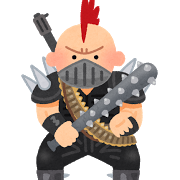

# h1 **Title**  
readme.mdのmdはマークダウンの拡張子  
これをつけないと認識されない。
- item1
  + item2
    * item3  
[Ctrl]+[Sift]+[M]キー  
Packagesも 便利  
#　区切り線
---  

***  

___  

- - -
## h3 小見出し

###### h6まである

半角スペース２つで改行できる↓  
空の行をいれても改行できる(一行空くけども)

hello.  
hello.hello.hello.
hello.hello.hello.hello.
hello.hello.  

hello.hello.hello.hello.
hello.hello.hello.hello.
hello.hello.

# 引用
> quote.quote.quote.  
quote.quote.quote.  

## 引用とは
他の著作物の一部を抜粋し、  
それについて、本文と明確に  
分ける。  
パクツイ駄目ｗ

# 強調表現  
normal *kyoutyou* kyoutyou  
他  _o_,**強調**
さらに書体強調

# 箇条書き
- item
- item

      前後に空行  
      スペース4つ段下げ６つ枠がつく。

- item
# 連番リスト  

  1. 数字.スペース
  1. 数字は何でもよい
  5. 3になる

## rink  
<http://dotoinstall.com>  

http://dotoinstall.com  

[リンクのタイトル](http://dotoinstall.com)  

# コードを見やすく  
```
function(){  
return x;   
}
```
```javascript
//shift + @ キー  
function x(){
   return x;
}

```
```cs
pubulic static int g;
void Start(){  
    int num = 321;
}
```
---
# 画像
- ALT属性とは、画像が取得できなかったり、非表示のときに、  
代わりに表示される文字列


## 画像にリンク

[](http://dotinstall.com)

リンクと画像を組み合わせたもの。ブラケット内に、画像のマークダウンを書いて、（）内にリンク先のURLを書く  

- [いらすとや](http://www.irasutoya.com/)  
世紀末の男

